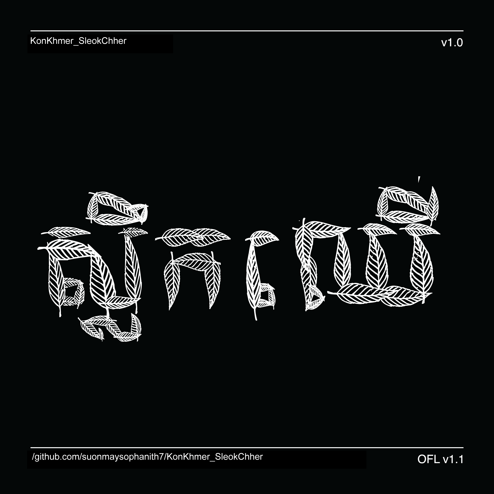

# My Font

[![][Fontbakery]](https://suonmaysophanith7.github.io/KonKhmer_SleokChher/fontbakery/fontbakery-report.html)
[![][Universal]](https://suonmaysophanith7.github.io/KonKhmer_SleokChher/fontbakery/fontbakery-report.html)
[![][GF Profile]](https://suonmaysophanith7.github.io/KonKhmer_SleokChher/fontbakery/fontbakery-report.html)
[![][Outline Correctness]](https://suonmaysophanith7.github.io/KonKhmer_SleokChher/fontbakery/fontbakery-report.html)
[![][Shaping]](https://suonmaysophanith7.github.io/KonKhmer_SleokChher/fontbakery/fontbakery-report.html)

[Fontbakery]: https://img.shields.io/endpoint?url=https%3A%2F%2Fraw.githubusercontent.com%2Fsuonmaysophanith7%2FKonKhmer_SleokChher%2Fgh-pages%2Fbadges%2Foverall.json
[GF Profile]: https://img.shields.io/endpoint?url=https%3A%2F%2Fraw.githubusercontent.com%2Fsuonmaysophanith7%2FKonKhmer_SleokChher%2Fgh-pages%2Fbadges%2FGoogleFonts.json
[Outline Correctness]: https://img.shields.io/endpoint?url=https%3A%2F%2Fraw.githubusercontent.com%2Fsuonmaysophanith7%2FKonKhmer_SleokChher%2Fgh-pages%2Fbadges%2FOutlineCorrectnessChecks.json
[Shaping]: https://img.shields.io/endpoint?url=https%3A%2F%2Fraw.githubusercontent.com%2Fsuonmaysophanith7%2FKonKhmer_SleokChher%2Fgh-pages%2Fbadges%2FShapingChecks.json
[Universal]: https://img.shields.io/endpoint?url=https%3A%2F%2Fraw.githubusercontent.com%2Fsuonmaysophanith7%2FKonKhmer_SleokChher%2Fgh-pages%2Fbadges%2FUniversal.json

# About

KonKhmer_SleokChher is a revised design and which is one of Suon May Sophanith's typefaces designed and published in 2015. 
This font is kind of leaf that a modern display Khmer typeface based on the writing style of a brush used on a wall. a medium size and is suitable for headings and large typography. In this new version.

KonKhmer_SleokChher is designed by Suon May Sophanith, a Cambodian self-taught typeface designer based in Phnom Penh, Cambodia. Work for Graphic Design and custom font design services. based in Phnom Penh, Cambodia. and has started designing type in since 2013. 

KonKhmer_SleokChher is designed by Suon May Sophanith in 2015.

## Building

Fonts are built automatically by GitHub Actions - take a look in the "Actions" tab for the latest build.

If you want to build fonts manually on your own computer:

* `make build` will produce font files.
* `make test` will run [FontBakery](https://github.com/googlefonts/fontbakery)'s quality assurance tests.
* `make proof` will generate HTML proof files.

The proof files and QA tests are also available automatically via GitHub Actions - look at https://suonmaysophanith7.github.io/KonKhmer_SleokChher.

## Changelog

When you update your font (new version or new release), please report all notable changes here, with a date.
[Font Versioning](https://github.com/googlefonts/gf-docs/tree/main/Spec#font-versioning) is based on semver. 
Changelog example:

**26 May 2021. Version 2.13**
- MAJOR Font turned to a variable font.
- SIGNIFICANT New Stylistic sets added.

## License

This Font Software is licensed under the SIL Open Font License, Version 1.1.
This license is available with a FAQ at
https://scripts.sil.org/OFL

## Repository Layout

This font repository structure is inspired by [Unified Font Repository v0.3](https://github.com/unified-font-repository/Unified-Font-Repository), modified for the Google Fonts workflow.
